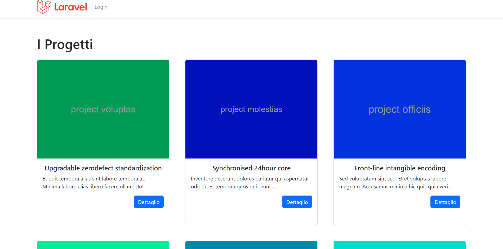
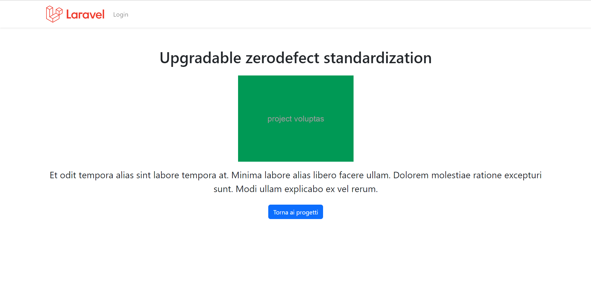

<h1><strong style="color: #EF3B2D;">9 + BOOTSTRAP TEMPLATE</strong></h1>

# Laravel Boolfolio

> Sistema di gestione del Portfolio dei miei progetti.

## Descrizione:

Realizzazione progetto usando laravel breeze ed il pacchetto Laravel 9 Preset con autenticazione.

## Svolgimento

Iniziamo con il definire il layout, `Model`, `Migration`, `Controller` e `Route` necessarie per il sistema portfolio:

1.  _Autenticazione_: si parte con l'autenticazione e la creazione di un layout per back-office.
2.  Creazione del modello Project con relativa `migration`, `seeder`, `controller` e `routes`
3.  Per la parte di back-office creiamo un _resource controller_ Admin\ProjectController per gestire tutte le operazioni CRUD dei progetti.
4.  Possibilità di cliccare sul titolo della colonna nella tabella Backoffice per visualizzare risultati in oridine crescente.
    Al successivo click, l'ordine si invertirà, e quello visualizzato sarà quindi decrescente.
    Di default l'ordine di visualizzazione è da quello con la modifica più recente in poi.
5.  Possibilità di allegare le immagini ai progetti come dei veri e proprio file.

## Bonus

1.  Dividete i fogli di stile front e back office e realizzate una homepage del sito in cui visualizzare i progetti per tutti gli utenti Guest in formato "card".
    

2.  Sul click su una card mostrare una pagina di dettaglio.
    
